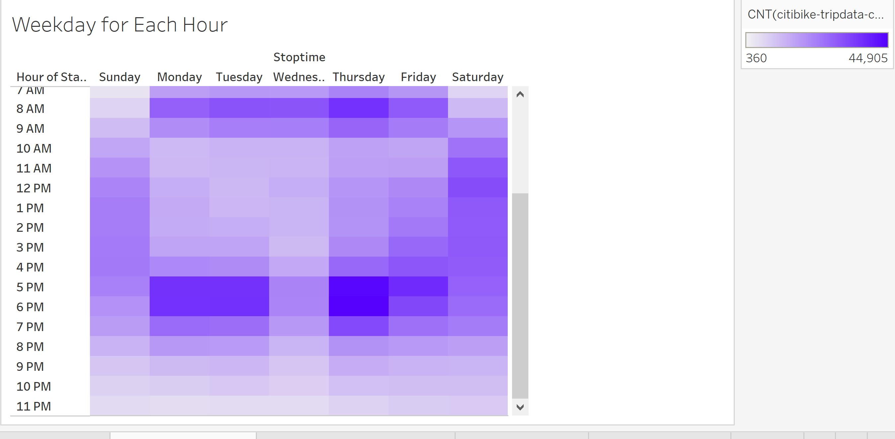

# bikesharing

## Purpose

The purpose of this analysis was to understand the bikeshare data. We used different visulization tools such as line graphs, heatmaps, and lat/long maps. 

## Results

In this map we find that most bikes are used in Manhatten and less are used in surrounding bourghs. We also find that the bigger red dots are where bikes routes start most frequently.

In this map we see where most bike routes end and it is stratified by gender. We can see that men use the bikes more and most routes end in Manhatten.

We found that most rides were completed in less than 1 hour, peaking at 5 minutes. We found that men used the bikes more. Women follow the same paattern with a peak of 6. Unknown gender had less of a peak and were between 8 to 28 minutes.

In this heat map we find that the bikes are most commonly used during commute hours (8 am and 5-6 pm). We also see that bikes are used most on Thursday followed by Monday and Tuesday.For weekdays the bikes are used least on Wednesday. We do not see a change in this when stratfied by gender. 

Most customers are Male and are subscribers. Most people of unknown gender are customers. 
People who are subscribers are more likely to use the bikes on weekdays and customers are more likely to use them on weekends.

## Summary
Overall we found that mostly men used the bikes. We also found that most people used bikes on the weekdays during commute hours (8 am and 5-6 pm). We also can see that men use the bikes mroe when we map out where they return bikes. We also notice that bikes are mostly used within Manhatten and less in neighboring bourghs. 

[Link to Story](https://public.tableau.com/app/profile/juhi.aggarwal5677/viz/Challenge_16667763017050/Story1?publish=yes)

